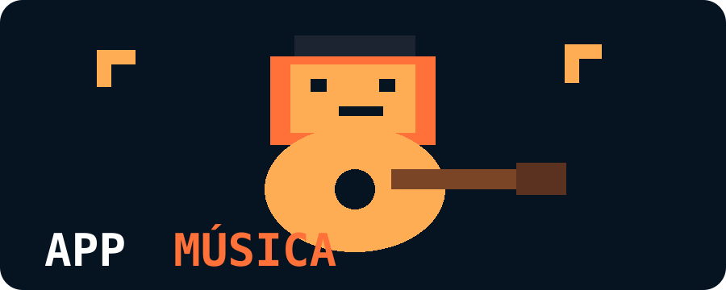

# 🎵 Plataforma Digital de Educação Musical — Protótipo



🇧🇷 Português | [🇺🇸 English](README.en.md) | [🇪🇸 Español](README.es.md)

> Protótipo de um ecossistema digital para divulgação, captação, atendimento, agendamento, aulas, conteúdos e gestão de serviços de educação musical.

## 🌐 Protótipo navegável

**[▶️ Acessar o protótipo publicado no GitHub Pages](https://sayjinblackbelt.github.io/APP_Musica/)**

O protótipo apresenta duas experiências principais:

- 🎵 **Usuário / Aluno** — acompanhamento de aulas, agenda, materiais e progresso.
- 🎓 **Professor / ADM** — visão de alunos, agenda, acompanhamento, materiais e indicadores.

Os dados apresentados são fictícios e o protótipo tem finalidade de validação de experiência, não de operação real.

## 🎨 Identidade visual

O projeto utiliza uma identidade **pixel art autoral** como assinatura visual, mantendo a interface principal em linguagem moderna e funcional.

- Logo: `assets/app-musica-logo-pixel.svg`
- Ícone: `assets/app-musica-icon.svg`
- Aplicação: interface, materiais, favicon/PWA e peças de divulgação, conforme viabilidade.

A identidade completa está documentada em `docs/14-identidade-visual-pixel-art.md`.

## 🎯 Sobre este repositório

Este repositório documenta a concepção, prototipagem e evolução de uma plataforma digital voltada à educação musical.

O projeto parte de uma necessidade real de organizar a jornada do aluno e a operação do educador, inicialmente utilizando **dados fictícios e sanitizados**.

O foco está no percurso completo:

**Descoberta → Cadastro → Atendimento → Serviço → Agendamento → Aula → Conteúdo → Acompanhamento → Renovação**

## 🧩 Principais áreas

- 🌐 Presença digital e landing page
- 📝 Captação e cadastro de interessados
- 👥 Gestão de alunos e leads
- 📅 Agendamento e calendário
- 🎥 Aulas on-line e conteúdos gravados
- 📚 Materiais didáticos
- 💳 Planos e possibilidades de pagamento
- 🤖 Automações e comunicação
- 📊 Indicadores e acompanhamento
- 💼 Novos serviços e consultorias
- 📱 PWA/aplicativo como evolução futura

## 🧭 Estratégia de desenvolvimento

O projeto será desenvolvido de forma incremental:

1. **Protótipo** — validar a experiência e os fluxos.
2. **Estrutura** — definir requisitos, arquitetura e integrações.
3. **Proposta** — consolidar escopo, prioridades, custos e roadmap.
4. **MVP** — implementar somente o núcleo validado.
5. **Evolução** — automações, conteúdo, pagamentos, métricas e aplicativo.

## 📂 Organização do repositório

```text
.
├── 01_Documentacao/        # visão, objetivos, requisitos e governança
├── 02_Planejamento/        # roadmap, prioridades e arquitetura
├── 03_Sprints/             # ciclos de prototipagem e desenvolvimento
├── 04_Materiais_Educador/  # materiais e referências para operação
├── 05_Materiais_Usuarios/  # materiais e conteúdos da experiência do usuário
├── assets/                 # identidade visual e materiais visuais
├── data/                   # dados fictícios/sanitizados
├── docs/                   # documentos técnicos e sínteses
└── index.html              # protótipo publicado no GitHub Pages
```

A estrutura será ampliada conforme o projeto avançar, evitando criar pastas vazias apenas por padronização.

## 🔐 Privacidade e publicação responsável

Este repositório é público. Não publicar dados pessoais, contatos, credenciais, informações financeiras ou dados identificáveis de alunos.

Os exemplos iniciais devem utilizar dados fictícios, agregados ou devidamente sanitizados.

## 🚧 Status

🟡 **Protótipo / descoberta de produto — em desenvolvimento.**

## 👤 Autor

**Filipe G Morais**

GitHub: https://github.com/sayjinblackbelt  
Repository: https://github.com/sayjinblackbelt/APP_Musica
